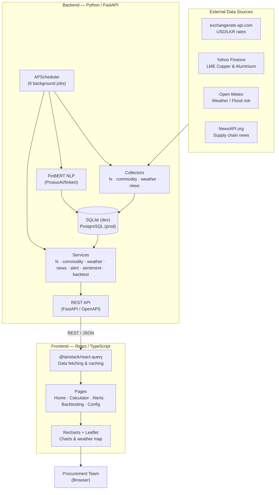
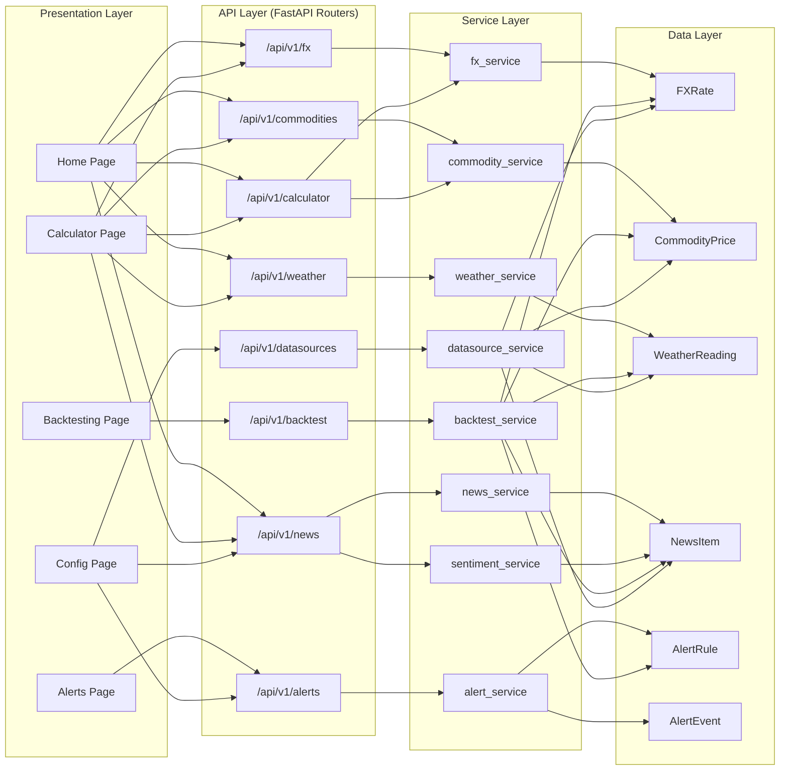
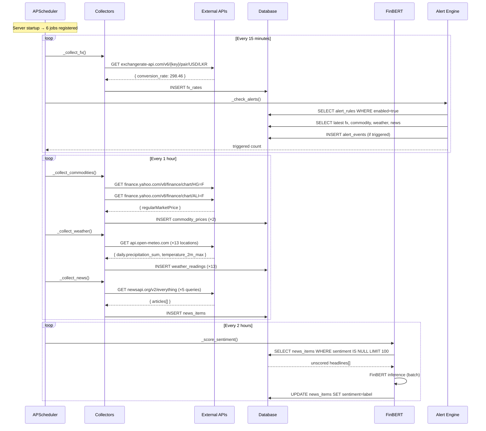
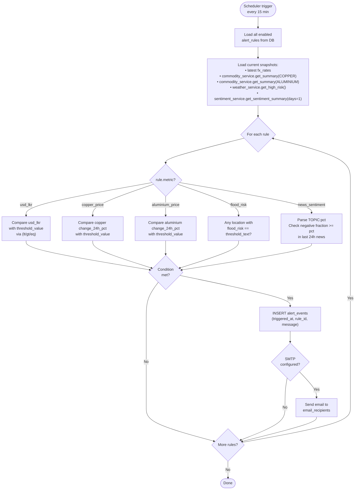
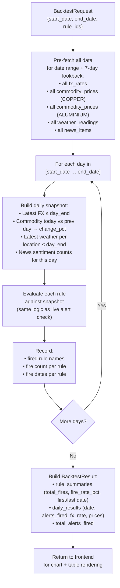
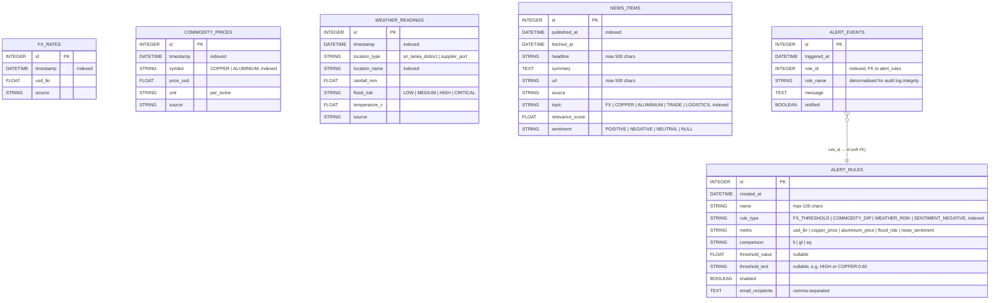
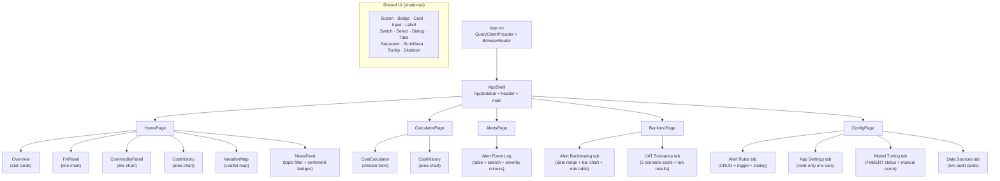
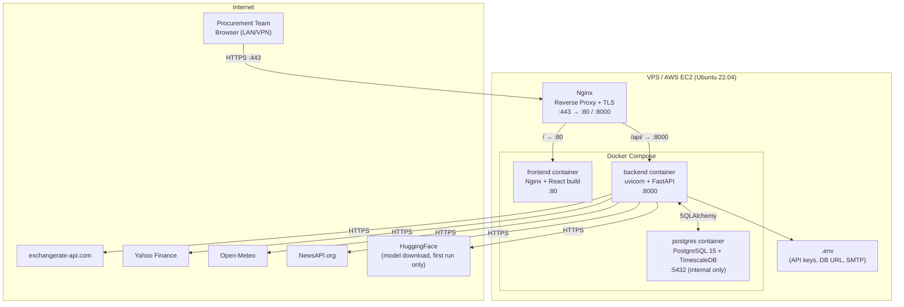
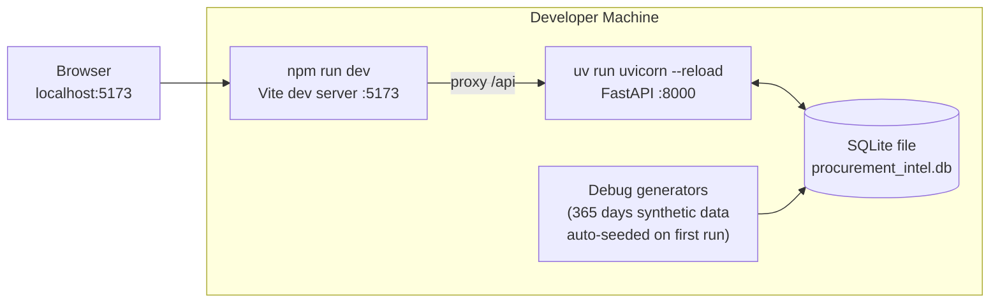

# ACL Cables Procurement Intelligence Dashboard — Architecture Document

> **Version:** 1.0 | **Date:** 2026-05-13 | **Status:** Phase 3 (all phases complete)

---

## 1. System Overview

The Procurement Intelligence Dashboard is a three-tier web application that aggregates external market data, processes it through an intelligence layer, and presents it to procurement decision-makers via a browser-based dashboard.

---

## 2. Layer Architecture

---

## 3. Data Collection & Scheduler Flow

---

## 4. Alert Evaluation Flow

---

## 5. Backtest Algorithm Flow

---

## 6. Database Entity-Relationship Diagram

---

## 7. Frontend Component Tree

---

## 8. Deployment Architecture

### Development Setup

---

## 9. Technology Stack Summary

| Layer | Technology | Version | Role |
|-------|-----------|---------|------|
| Backend runtime | Python | 3.12 | Server-side language |
| Web framework | FastAPI | 0.136 | REST API, auto OpenAPI docs |
| Package manager | uv | 0.4+ | Python deps & virtualenv |
| ORM | SQLAlchemy | 2.x | Database abstraction |
| Database (dev) | SQLite | 3.x | Zero-setup local storage |
| Database (prod) | PostgreSQL + TimescaleDB | 15 | Time-series optimised |
| Scheduler | APScheduler | 3.11 | In-process background jobs |
| NLP model | FinBERT (ProsusAI) | — | Financial sentiment scoring |
| ML runtime | PyTorch (CPU) | 2.12 | FinBERT inference |
| HTTP client | httpx | 0.28 | Async-compatible collector requests |
| Frontend framework | React | 19 | Component-based UI |
| Language | TypeScript | 6 | Type-safe frontend |
| Build tool | Vite | 8 | Dev server + production bundler |
| Styling | Tailwind CSS | v3 | Utility-first CSS |
| Component library | shadcn/ui (hand-written) | — | Accessible UI primitives |
| Charts | Recharts | 3 | Line, area, bar charts |
| Maps | react-leaflet | — | Weather map (Leaflet.js) |
| Data fetching | @tanstack/react-query | v5 | Server state, caching |
| Routing | react-router-dom | v7 | Client-side navigation |
| Container | Docker + Docker Compose | 24+ | Dev & prod packaging |
| Reverse proxy | Nginx | 1.24+ | TLS termination, routing |

---

*Architecture document v1.0 — ACL Cables Procurement Intelligence Dashboard*
