# Procurement Intelligence Dashboard
## Pitch Deck — ACL Cables PLC

---

# SLIDE 1 — Title

**Procurement Intelligence Dashboard**
*Turning manual risk monitoring into automated decision intelligence*

> Built specifically for ACL Cables PLC procurement operations
> Powered by real data from your own Annual Report 2024/25

---

# SLIDE 2 — The Problem: What Your Annual Report Revealed

## ACL's Current State: 4 Unaddressed Risk Areas

| Risk | Annual Report Rating | Current Mitigation | Critical Problem |
|------|---------------------|--------------------|-----------------|
| Exchange Rate Risk (#6) | **Moderate** | "Continuously monitor macroeconomic trends" | 100% manual, person-dependent, reactive |
| Sustainability & Climate Risk (#9) | **Moderate** | "Continuous evaluations of sustainability risks" | No operational tooling — zero early warning |
| Country Risk (#2) | **Significant** | "Perform comprehensive PESTEL evaluation" | Manual news scanning across 4 supplier countries |
| Operational Risk (#4) | **Moderate** | "Business Continuity Plan in place" | No data-driven trigger for Business Continuity Plan activation |

> **Source: ACL Cables PLC Annual Report 2024/25, Risk Management Section pp. 64–71**

---

# SLIDE 3 — The Financial Stakes

## The Financial Cost of Inaction

```
Group Revenue FY2024/25:             Rs. 37,487 Mn
Import-linked procurement:                57% of purchases
Import procurement value (est.):     Rs. 21,368 Mn/year

──────────────────────────────────────────────────────────
1% improvement in Exchange Rate timing:  Rs. 213 Mn saved
──────────────────────────────────────────────────────────

Exchange Rate Impact Already Proven in Your Own Annual Report:
  FY2023/24 average rate:  USD/LKR 317
  FY2024/25 average rate:  USD/LKR 297
  Gross margin change:     24.47% → 27.27%  (+2.8pp)
  Gross profit gain:       +Rs. 3,081 Mn year-on-year

"Exchange rate predictability minimized volatility in raw material
procurement costs, aiding margin management." — ACL Annual Report 2024/25 MDA
```

---

# SLIDE 4 — Risk Coverage Analysis

## Current Capability vs. What Is Required

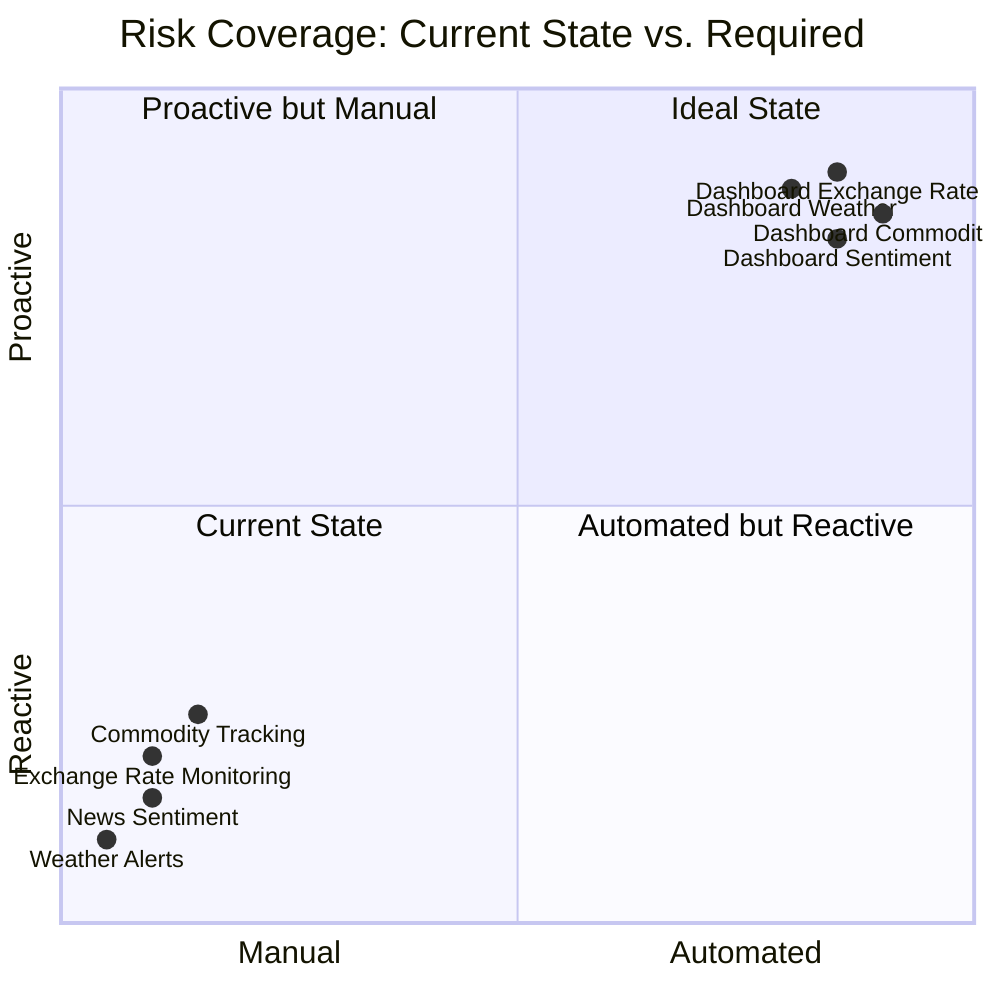

### Deficiency-to-Solution Mapping

| Identified Deficiency | Evidence from Annual Report | Our Solution |
|----------------------|----------------------------|--------------|
| Manual Exchange Rate monitoring | Risk #6: all 3 mitigations are manual processes | Automated USD/LKR monitoring every 15 minutes with configurable threshold alerts |
| No commodity price tracking | Risk #6 names Copper, Aluminium, XLPE explicitly | Live London Metal Exchange copper and aluminium price feeds with 24-hour change alerts |
| Manual news scanning | Risk #2 (Country Risk): manual PESTEL evaluation | AI-powered (FinBERT) geopolitical news sentiment scoring across 5 topic channels |
| No weather early warning | Risk #9, C1: floods formally documented as logistics risk | Real-time flood risk monitoring across all 25 Sri Lanka districts and 4 supplier ports |
| No pre-positioning trigger | Risk #4: Business Continuity Plan exists but no data trigger | Automated alert: "Western Province MEDIUM risk for 48 hours — pre-position stock now" |
| No cost-impact modelling | Procurement decisions made without quantified landed cost | Landed cost calculator: quantity × London Metal Exchange price × Exchange Rate → LKR cost instantly |

---

# SLIDE 5 — Product Overview

## Five Modules. One Dashboard.

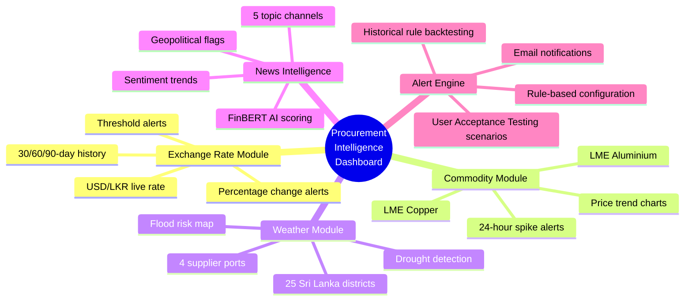

---

# SLIDE 6 — How It Solves Each Problem

## Before and After: Manual Process vs. Dashboard

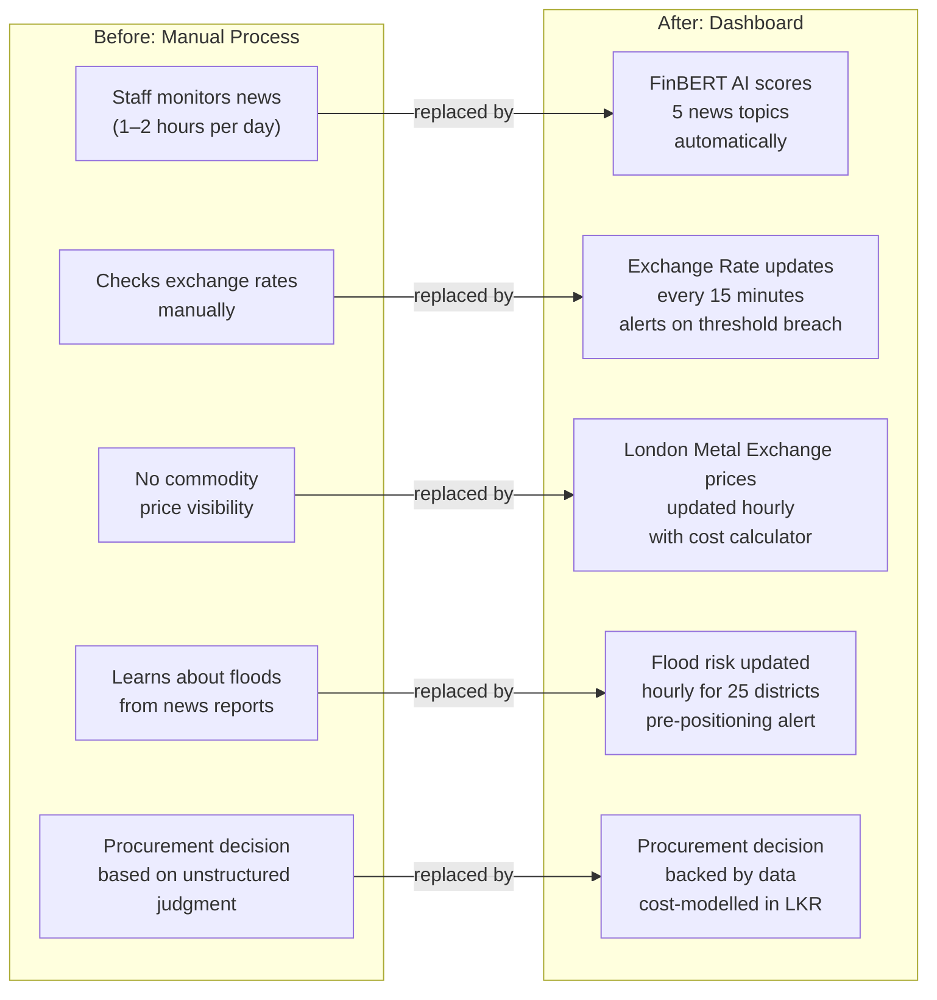

---

# SLIDE 7 — Dashboard Pages

## What Your Procurement Team Sees

| Page | Purpose | Key Features |
|------|---------|--------------|
| **Home** | Real-time intelligence overview | Exchange Rate chart · Commodity trends · Weather map · News feed with AI sentiment badges |
| **Calculator** | Cost-impact modelling | Enter: material + quantity + optional price overrides → Output: exact LKR landed cost |
| **Alerts** | Alert event log | Colour-coded by severity · Searchable · Rule-linked history |
| **Backtesting** | Validate alert rules | Run rules against 365 days of history · See fire rate · 5 pre-built User Acceptance Testing scenarios |
| **Configuration** | Customise the system | Create and edit alert rules · Toggle data sources · Tune AI model · View data source health |

---

# SLIDE 8 — The Alert Engine

## Configurable Rules Aligned to Your Risk Register

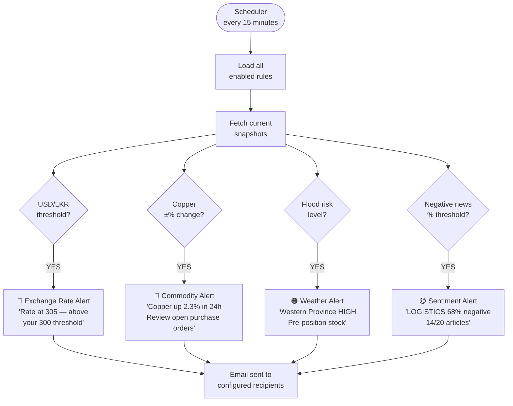

### Example Alert Rules for ACL Procurement

| Rule | Trigger | Recommended Action |
|------|---------|-------------------|
| Favourable Exchange Rate Window | USD/LKR drops below 290 | "Favourable rate — consider advancing copper order" |
| Exchange Rate Depreciation Warning | USD/LKR sustained above 305 for 48 hours | "Sustained depreciation pressure — lock in orders before further deterioration" |
| Commodity Price Spike | Copper price rises more than 2% in 24 hours | "London Metal Exchange copper spike — review open purchase orders and spot purchase timing" |
| Flood Pre-positioning | Western Province flood risk HIGH | "Logistics warning — pre-position stock before delivery window closes" |
| Geopolitical Risk Flag | China trade news more than 60% negative | "Supply chain risk flag — monitor supplier communications in UAE and Vietnam" |

---

# SLIDE 9 — Benefits Over Manual Process

## Quantified Advantages

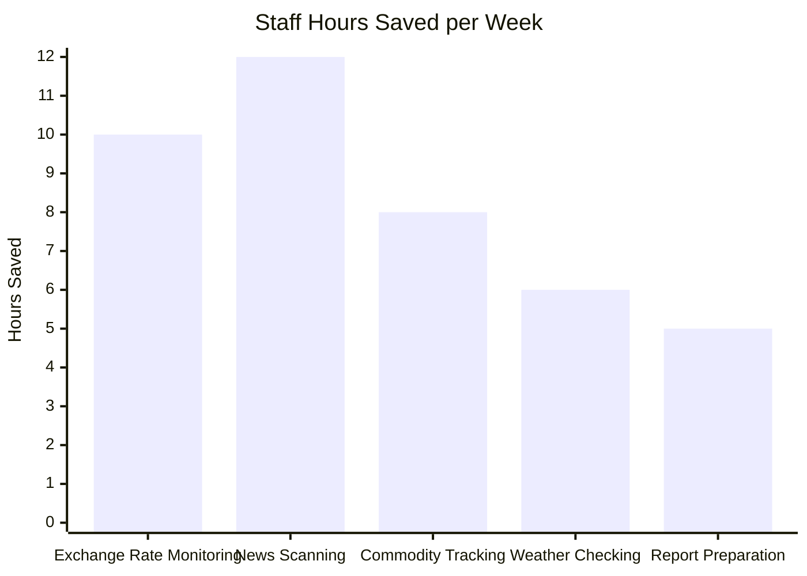

| Metric | Manual Process | With Dashboard | Improvement |
|--------|---------------|---------------|-------------|
| Exchange Rate monitoring frequency | Once or twice daily | Every 15 minutes | **48 times more frequent** |
| Time to news signal | 1–2 hours post-publication | Under 2 hours (automated) | Consistent coverage |
| Weather awareness | Reactive — learned via news | 1-hour advance data | Proactive |
| Cost modelling | Manual spreadsheet calculation | Instant LKR landed cost calculator | Real-time |
| Alert notification | None — no alerts exist | Configurable precision thresholds | Automated early warning |
| Audit trail | None | Full timestamped event log | Compliance-ready |

### Competitive Advantages

| Feature | Generic Business Intelligence Tools | Bloomberg Terminal | Our Dashboard |
|---------|------------------------------------|--------------------|---------------|
| Built for ACL's specific risk profile | ✗ | ✗ | ✅ |
| Sri Lanka district-level weather map | ✗ | ✗ | ✅ |
| Supplier country monitoring (UAE, China, Vietnam, Singapore) | Generic only | Partial | ✅ Targeted |
| FinBERT financial AI sentiment scoring | ✗ | ✓ (at significant cost) | ✅ |
| SLFRS S1/S2 climate data export | ✗ | ✗ | ✅ (Phase 4) |
| Annual cost | $0–$500 | ~$25,000 USD per year | See Slide 11 |
| Customisation for ACL operations | None | None | Full |

---

# SLIDE 10 — Technical Architecture

## System Overview

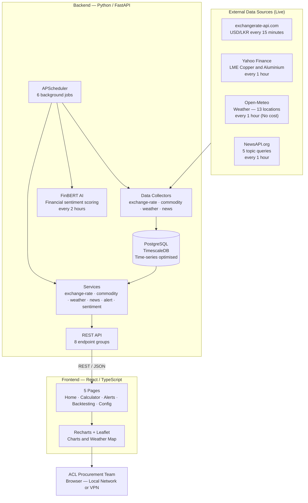

---

# SLIDE 11 — Data Collection and AI Pipeline

## How Data Flows Through the System

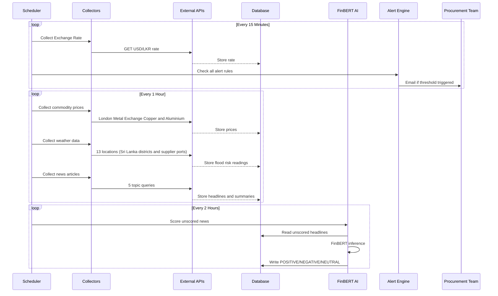

---

# SLIDE 12 — Deployment Architecture

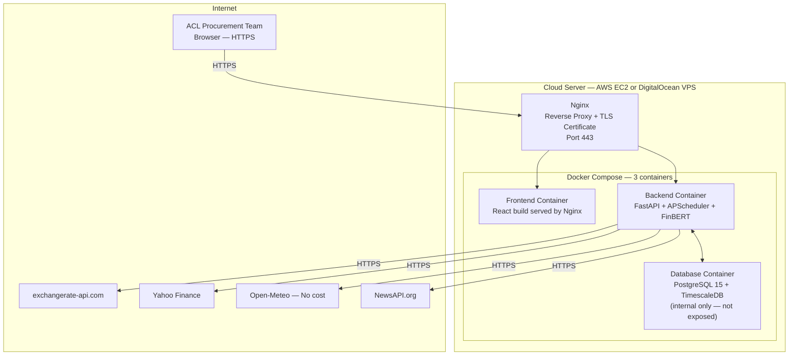

---

# SLIDE 13 — Database Design

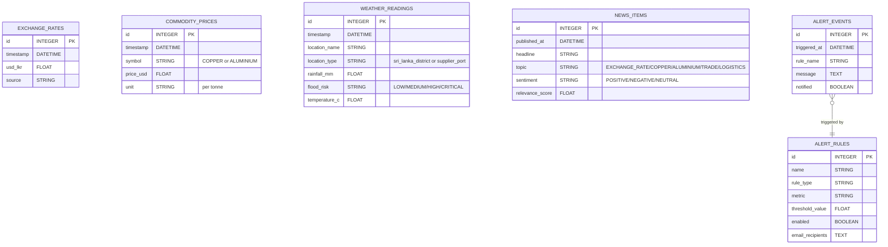

---

# SLIDE 14 — Technology Stack

## Production-Ready, Enterprise-Grade Components

| Layer | Technology | Why Chosen |
|-------|-----------|-----------|
| Backend | Python 3.12 + FastAPI | High-performance REST API · Auto-generated documentation |
| AI / Natural Language Processing | FinBERT (ProsusAI) | Pre-trained financial sentiment model · No custom training required |
| Database | PostgreSQL + TimescaleDB | Time-series optimised · Scales to years of historical data |
| Scheduler | APScheduler | In-process background jobs · No separate queue server required |
| Frontend | React 19 + TypeScript | Type-safe · Component-based · Enterprise-grade user interface |
| Charts | Recharts + Leaflet | Interactive charts · Sri Lanka map with district-level markers |
| Styling | Tailwind CSS + shadcn/ui | ACL brand colours (blue + gold) · Light and dark mode |
| Deployment | Docker Compose + Nginx | Containerised · Single-command deployment · HTTPS included |

---

# SLIDE 15 — Cost Analysis

## External Data API Costs: No-Cost vs. Paid Tiers

| Data Provider | Data Provided | No-Cost Tier | Paid Tier | Recommendation |
|--------------|--------------|-------------|-----------|----------------|
| Open-Meteo | Weather (13 locations) | **No cost — no API key required** | Not applicable — always free | Use no-cost tier |
| exchangerate-api.com | USD/LKR live rate | 1,500 requests/month | ~$10/month (~Rs. 2,970) | No-cost tier sufficient for 15-minute polling |
| Yahoo Finance | London Metal Exchange Copper and Aluminium | **No cost — no API key required** | Metals API: ~$29/month | Begin with no-cost; upgrade if reliability issues arise |
| NewsAPI.org | Supply chain news | 100 requests/day (developer) | Business: $449/month | **Alternative: Reuters/Bloomberg RSS feeds = No cost** |

### Monthly Cost Scenarios

| Scenario | Monthly Cost | Annual Cost |
|----------|-------------|-------------|
| All no-cost tiers (recommended starting point) | **$0** | **Rs. 0** |
| Exchange Rate API (paid) + all others no-cost | $10 (~Rs. 2,970) | Rs. 35,640 |
| Exchange Rate API + Metals API + hosting | $69 (~Rs. 20,493) | Rs. 245,916 |
| All paid APIs + hosting | $518 (~Rs. 153,846) | Rs. 1,846,152 |
| Bloomberg Terminal (market alternative) | ~$2,100 USD/month | **Rs. 74,718,000** |

---

# SLIDE 16 — Hosting Costs

## Infrastructure Options

| Option | Monthly Cost | Annual Cost | Best For |
|--------|-------------|-------------|----------|
| AWS EC2 t3.medium (2 vCPU, 4 GB) | ~$33 (~Rs. 9,801) | Rs. 117,612 | Recommended initial deployment |
| AWS EC2 t3.large (2 vCPU, 8 GB) | ~$60 (~Rs. 17,820) | Rs. 213,840 | Scaled deployment with Enterprise Resource Planning integration |
| DigitalOcean Droplet 4 GB | ~$24 (~Rs. 7,128) | Rs. 85,536 | Cost-optimised alternative |
| ACL Internal Server (if available) | Rs. 0 (capital expenditure only) | Rs. 0 | Preferred if ACL IT infrastructure can support it |

### Total Cost of Ownership vs. Savings

```
Monthly Hosting (EC2 t3.medium):                 Rs.  9,801
Monthly Exchange Rate API (paid):                Rs.  2,970
Monthly Metals API (optional):                   Rs.  8,613
─────────────────────────────────────────────────────────
Total Monthly (recommended configuration):       Rs. 21,384
Total Annual:                                    Rs. 256,608
─────────────────────────────────────────────────────────

Potential saving from 0.1% better Exchange Rate timing:
  0.1% × Rs. 21,368 Mn import base  =  Rs. 21.4 Mn/year

Return on Investment at 0.1% improvement:       83× annual cost
Return on Investment at 1.0% improvement:      830× annual cost
─────────────────────────────────────────────────────────
Bloomberg Terminal alternative cost:   Rs. 74,718,000/year
Our dashboard annual cost:             Rs.    256,608/year
Cost saving vs Bloomberg Terminal:     Rs. 74,461,392/year
```

---

# SLIDE 17 — What ACL Saves By Using This

## Labour Cost Savings (Conservative Estimate)

| Task Currently Done Manually | Hours/Week | Team Members | Weekly Cost (est. Rs. 2,000/hr) | Annual Cost |
|------------------------------|-----------|--------------|--------------------------------|-------------|
| Exchange Rate monitoring and recording | 5 hrs | 1 | Rs. 10,000 | Rs. 520,000 |
| News scanning (4 supplier countries) | 10 hrs | 1–2 | Rs. 20,000 | Rs. 1,040,000 |
| Weather and logistics checks | 3 hrs | 1 | Rs. 6,000 | Rs. 312,000 |
| Manual cost calculations (spreadsheet) | 4 hrs | 1 | Rs. 8,000 | Rs. 416,000 |
| **Total manual effort eliminated** | **22 hrs/week** | | **Rs. 44,000/week** | **Rs. 2,288,000/year** |

> Dashboard annual cost: **Rs. 256,608** · Annual labour saved: **Rs. 2,288,000** · Labour Return on Investment alone: **8.9×**

---

# SLIDE 18 — Annual Report Evidence Map

## Every Feature Is Backed by Your Own Annual Report

| Dashboard Feature | Annual Report Section | Quoted Evidence |
|------------------|----------------------|-----------------|
| Exchange Rate monitoring (every 15 minutes) | Risk #6 · Management Discussion and Analysis · PEST | "Volatility in USD/LKR exchange rates affecting the cost of imported raw materials" |
| Copper and Aluminium price tracking | Risk #6 · Supply Chain | Risk #6 explicitly names Copper, Aluminium, XLPE as affected materials |
| Sri Lanka flood risk map | Risk #9 · C1 Physical · Natural Capital | "Severe flooding could disrupt our logistics network, delay deliveries, impact warehouse operations" |
| Supplier port weather (UAE, China, Vietnam, Singapore) | B5 Supply Chain | "Majority of raw materials are imported from UAE, China, Singapore and Vietnam" |
| Geopolitical news AI sentiment scoring | Risk #2 Country Risk · SWOT Threats | "US tariff structures will create an uneven level playing ground" |
| Drought and water stress alerts | C1 Chronic Physical Risks | "Water shortages can disrupt production efficiency, potentially leading to overheating and equipment malfunctions" |
| Landed cost calculator | D Financial Context | Exchange Rate movement from 317 to 297 contributed to 2.8 percentage point gross margin improvement |
| SLFRS S1/S2 climate data export (Phase 4) | C4 SLFRS Alignment | "ACL Cables PLC is closely monitoring the developments [of SLFRS S1/S2]" |

---

# SLIDE 19 — Implementation Timeline

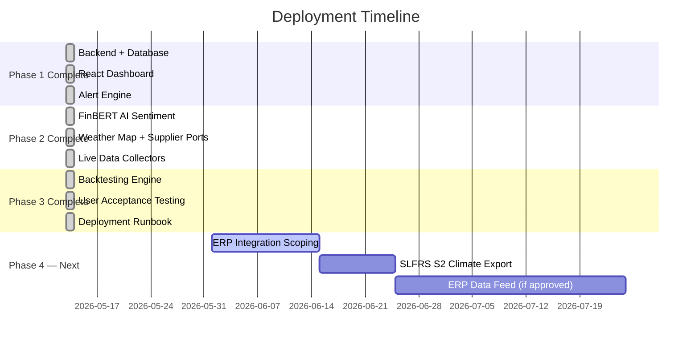

### Current Status: Production-Ready

| Phase | Status | Deliverable |
|-------|--------|-------------|
| Phase 1 — Foundation | ✅ Complete | Backend API · Database · Dashboard · Alert engine |
| Phase 2 — Intelligence | ✅ Complete | FinBERT AI · Weather map · Live data feeds · Sentiment alerts |
| Phase 3 — Validation | ✅ Complete | Backtesting · User Acceptance Testing scenarios · Deployment runbook · User guide |
| Phase 4 — ERP Integration | Optional | Discovery meeting with ACL IT required first |

---

# SLIDE 20 — Monitoring Coverage Map

## 25 Sri Lanka Districts + 4 Supplier Ports

```
Sri Lanka Coverage (flood risk, temperature, rainfall):
┌────────────────────────────────────────────────────┐
│  Northern Province:  Jaffna · Kilinochchi           │
│  North Western:      Puttalam · Kurunegala           │
│  North Central:      Anuradhapura · Polonnaruwa      │
│  Eastern:            Trincomalee · Batticaloa        │
│  Western:            ★ Colombo · Gampaha · Kalutara  │
│  Central:            Kandy · Matale · Nuwara Eliya   │
│  Sabaragamuwa:       Ratnapura · Kegalle             │
│  Southern:           Galle · Matara · Hambantota     │
│  Uva:                Badulla · Moneragala             │
└────────────────────────────────────────────────────┘

★ Colombo = primary logistics hub and warehouse area

Supplier Port Coverage (storm risk, port disruption):
┌─────────────────────────────────────────────────────┐
│  🇦🇪 Jebel Ali Port (UAE)   — primary UAE supplier hub │
│  🇨🇳 Shanghai Port (China)  — largest supplier country │
│  🇻🇳 Ho Chi Minh Port (Vietnam)                       │
│  🇸🇬 Singapore Port         — regional transhipment   │
└─────────────────────────────────────────────────────┘
```

---

# SLIDE 21 — Phase 4 Roadmap: Planned Enhancements

## All Enhancements Backed by Annual Report Evidence

| Enhancement | Annual Report Evidence | Estimated Effort | Business Impact |
|-------------|----------------------|-----------------|----------------|
| Drought and water stress detection | Risk #9, C1 Chronic Physical — "Water is crucial in cable manufacturing" | 1 day | High — unaddressed manufacturing continuity risk |
| Exchange Rate percentage change alert | Risk #6 — volatility matters more than absolute level | 2 hours | High — underlying data already exists |
| Cross-signal composite alerts | Risks #6 + #9 + B5 Supply Chain | 2 days | High — connects weather, Exchange Rate, and commodity signals |
| SLFRS S1/S2 climate data export | C4 — ACL actively pursuing SLFRS S2 alignment | 1.5 days | Medium — regulatory compliance use case |
| Central Bank rate overlay on Exchange Rate chart | Risk #6 PEST — policy rate context for interpretation | 1 day | Medium — improves rate movement interpretation |
| Enterprise Resource Planning integration (SAP/Sage) | Phase 4 open question | Discovery required | High — closes the loop on procurement execution |

---

# SLIDE 22 — Why Now

## Three Converging Pressures for ACL

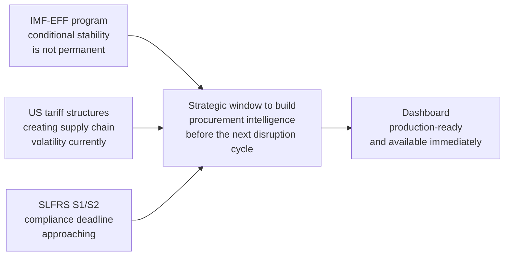

> *"The stabilization of the exchange rate further enhanced business predictability, fostering a conducive environment for industrial growth and investment."* — ACL MD's Report 2024/25

**The current period of Exchange Rate stability is the ideal time to build and calibrate this system — before the next period of volatility.**

---

# SLIDE 23 — Next Steps

## From Proposal to Production in 4 Steps

| Step | Action | Owner | Timeline |
|------|--------|-------|----------|
| 1 | Live demonstration of the dashboard using ACL's data | Development team | Week 1 |
| 2 | Procure API credentials (Exchange Rate, News) and provision cloud server | ACL IT / Procurement lead | Week 1–2 |
| 3 | Deploy with live data feeds and configure initial alert rules | Development team | Week 2–3 |
| 4 | Procurement team onboarding — user guide walkthrough and User Acceptance Testing | Procurement lead and team | Week 3–4 |

### Open Questions to Resolve

| Question | Why It Matters |
|----------|---------------|
| Cloud hosting or ACL internal server? | Determines outbound API access and security design |
| Who is the primary user in the procurement team? | Alert rule defaults and user interface training |
| Microsoft Teams or Slack in use? | Webhook-based alerts more effective than email for some teams |
| Which Enterprise Resource Planning or planning system is used? | Phase 4 integration scope and design |
| Forward contracts or spot purchases? | Determines which commodity price feed is most operationally relevant |

---

# SLIDE 24 — Summary

## The Business Case in One View

```
THE CHALLENGE:
  ACL's own Annual Report documents 4 risks with entirely manual mitigations
  57% of purchases are import-linked — every Exchange Rate movement matters
  A 1% improvement in Exchange Rate timing = Rs. 213 Mn saved annually

THE SOLUTION:
  Production-ready dashboard built specifically for ACL Cables PLC
  Monitors Exchange Rate · Commodities · Weather · News simultaneously
  AI-powered financial sentiment scoring (FinBERT)
  Configurable alerts → email notification → procurement team

THE COST:
  Rs. 256,608/year (hosting + paid API tiers)
  vs. Rs. 74,718,000/year (Bloomberg Terminal equivalent)
  vs. Rs. 2,288,000/year (manual labour being replaced)

THE RETURN:
  Labour savings alone:                         8.9× annual cost
  At 0.1% better Exchange Rate timing:         83× annual cost
  Status:                                       Production-ready today
```

---

*Presentation prepared for ACL Cables PLC | May 2026*
*Source: ACL Cables PLC Annual Report 2024/25 | All figures and quotes sourced directly from the published Annual Report*
